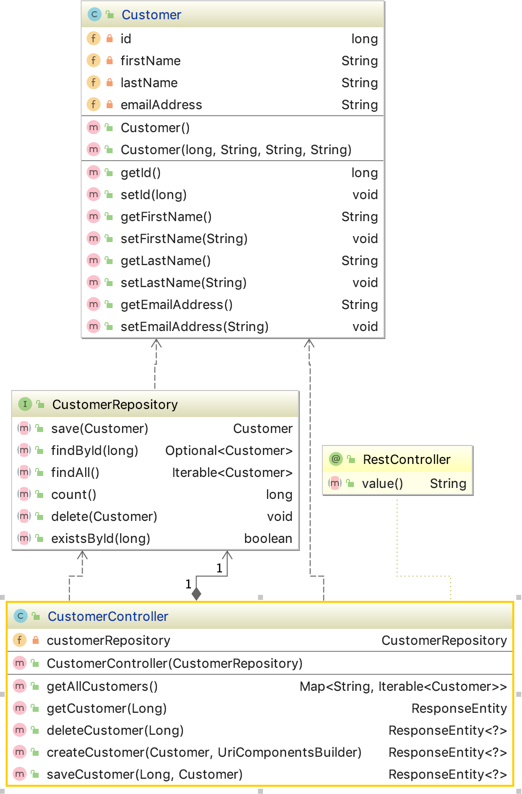
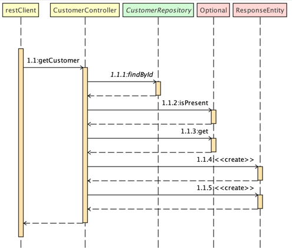
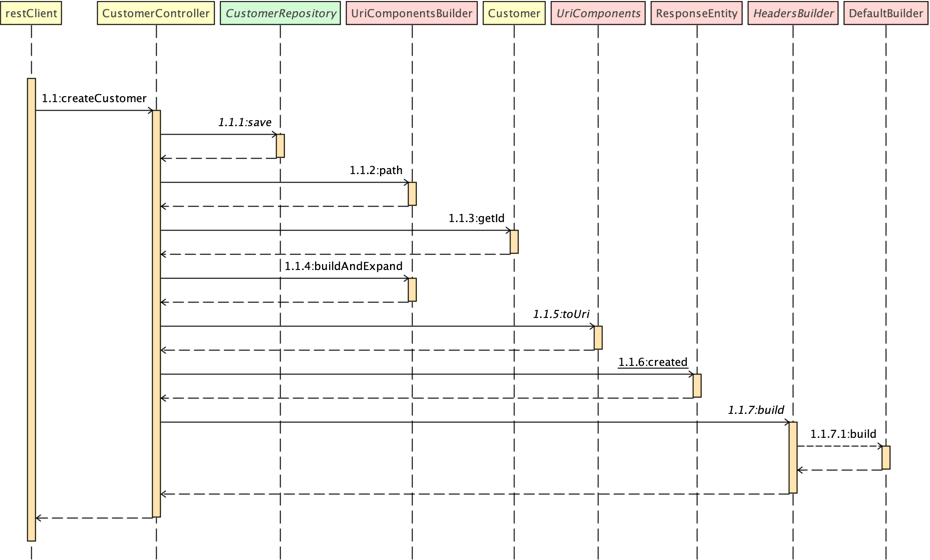

# Java IV REST Controllers Lab

Completing this lab demonstrates your ability to code Spring REST
controllers in a standards based way.

## Objective

Write a fully functional REST controller for the customers API

## Getting Started:

1. Copy the starter code from here into a new, private repository in your personal GitHub account using [these instructions](https://github.com/jeff-anderson-cscc/submitting-assignments-lab#copy-the-starter-code-into-a-new-private-repository-in-your-personal-github-account) substituting this repository URL ``https://github.com/jeff-anderson-cscc/java4-labs-rest-controllers`` for the one referenced in that document
2. Create a new branch for your code changes as described in [these instructions](https://github.com/jeff-anderson-cscc/submitting-assignments-lab#before-you-start-coding)

## Completing the Assignment

__Important__ You may not change the code in any test cases. _The only permissible difference between the base version of the JUnit test class and yours is yours will have no tests commented out and the file is otherwise identical._

1. Open [CustomerControllerValidationTests](src/test/java/edu/cscc/java4/rest/CustomerControllerValidationTests.java)
1. One by one, uncomment each test, changing just enough code or configuration to make the test pass
1. Once all tests are passing, commit your changes

Each test validates conditions detailed in the specifications below

### Customer Controller

**Class Diagram:**

 
* You will be creating a CustomerController class which is shown in the class diagram above
* Your class should have the same method names and signatures
* The CustomerRepository interface is provided. Do not implement a concrete class for this interface or modify it's contents.
* The Customer class is provided. Do not modify it's contents.

### getAllCustomers

* **Example Request:** ``GET localhost:8080/api/customers``


* Step 1.1.3 puts the map key "customers" along with the data returned in step 1.1.2
* **Example Response:**
```json
{
    "customers": [
        {
            "id": 1,
            "firstName": "jeff",
            "lastName": "Anderson"
        },
        {
            "id": 2,
            "firstName": "Jeremy",
            "lastName": "Schmersal"
        }
    ]
}
```

### Get a Customer by ID

Get a customer by ID or return ``HttpStatus.NOT_FOUND`` if no customer exists with that ID

* **Example Request:** ``GET localhost:8080/api/customers/1``


* Step 1.1.4 creates a response entity with data from step 1.1.3 and ``HttpStatus.OK`` if step 1.1.2 returns true
* Step 1.1.5 creates a response entity with ``HttpStatus.NOT_FOUND`` if step 1.1.2 returns false
* **Example Response:**
```json
{
    "id": 1,
    "firstName": "jeff",
    "lastName": "Anderson"
}
```

### Create a Customer

* Example Request: ``POST: localhost:8080/api/customers``
* Example Request Headers: ``Content-Type: application/json`` 
* Example Request Body:
```json
{
	"firstName": "Jeremy",
	"lastName": "Schmersal",
	"emailAddress": "bar@foo.com"
}
```

* The code below can be used to create and return the location header as shown in steps 1.1.2 - 1.1.7:
```java
    UriComponents uriComponents = b.path("/api/customers/{id}").buildAndExpand(newCustomer.getId());
    return ResponseEntity.created(uriComponents.toUri()).build();
```
* Example Response Headers: ``Location: http://localhost:8080/api/customers/1`` 
* The response body is empty

### Update an Existing Customer

Save changes to an existing customer 

* Example Request: ``PUT: localhost:8080/api/customers/2``
* Example Request Headers: ``Content-Type: application/json`` 
* Example Request Body:
```json
{
	"firstName": "Rod",
	"lastName": "Johnson",
	"emailAddress": "rod.johnson@spring.io"
}
```

* Step 1.1.4 creates a response entity with the return data and ``HttpStatus.OK`` if step 1.1.1 returns true
* Step 1.1.5 creates a response entity with ``HttpStatus.NOT_FOUND`` if step 1.1.1 returns false
* The response body is empty


### Delete a Customer

* Example Request: ``DELETE: localhost:8080/api/customers/2``

* Step 1.1.5 creates a response entity with the return data and ``HttpStatus.NO_CONTENT`` if step 1.1.2 returns true
* Step 1.1.6 creates a response entity with ``HttpStatus.NOT_FOUND`` if step 1.1.2 returns false
* The response body is empty

### Helpful Documentation

* [1.3.2. Request Mapping](https://docs.spring.io/spring/docs/current/spring-framework-reference/web.html#mvc-ann-requestmapping)
* [1.3.3. Handler Methods](https://docs.spring.io/spring/docs/current/spring-framework-reference/web.html#mvc-ann-methods)
* [1.4. URI Links](https://docs.spring.io/spring/docs/current/spring-framework-reference/web.html#mvc-uri-building)


### OPTIONAL 

This won't be graded but will demonstrate your understanding of Java Bean validation in REST 
controllers

1. Open [CustomerControllerTests](src/test/java/edu/cscc/java4/rest/CustomerControllerTests.java)
1. One by one, uncomment each test, changing just enough code or configuration to make the test pass
1. Once all tests are passing, commit your changes

## Submitting Your Work

1. Push your changes to GitHub
1. Create a pull request for your branch using [these instructions](https://github.com/jeff-anderson-cscc/submitting-assignments-lab#once-you-are-ready-to-submit-your-work-for-grading)
1. Submit the assignment in Blackboard as described in [these instructions](https://github.com/jeff-anderson-cscc/submitting-assignments-lab#once-your-pull-request-is-created-and-i-am-added-as-a-reviewer)

__NOTE: I will provide feedback via. comments in your pull request.__
If you need to amend your work after you issue your initial pull request:

1. Commit your updates
1. Push your changes to gitHub
1. Verify the new commits were automatically added to your open pull request
